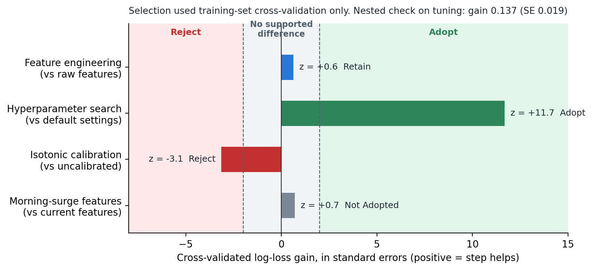
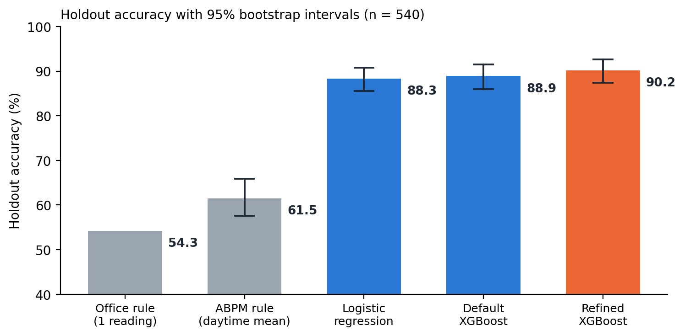

# Final Capstone Deliverable: Telehealth Hypertension Analytics
## Technical Audit, Scientific Report, and Presentation

**Student:** Raja Chakraborty  
**Course:** DSC-590: Data Science Capstone  
**Institution:** College of Science, Engineering, and Technology, Grand Canyon University  
**Instructor:** Jonathan Pollyn  
**Date:** October 7, 2026  
**GitHub Repository:** https://github.com/rajachakraborti/telehealth-hypertension-analytics  
**Release tag:** `topic7-submission`  
**Release commit:** `73adefd984fea9e9ace871aeb313d76900b2369e` (code, notebook, trained model, figures and tests). This document and the slide deck are committed immediately afterwards, so they cannot contain their own hash.  

---

# Part 1: Technical Audit

## 1. Scope and method
The audit covers the whole project at the release tag: the research notebook (data simulation, features, model selection), the backend (authentication, the ABPM staging service, the patient data layer and the earlier per-reading pipeline), the dashboard, the test suite and continuous integration, and every claim made in the Topic 5 to 7 reports. It assesses Competency 1.2, applying designated quantitative techniques to deploy appropriate models for analysis and prediction. The method had four steps.

1. **Claim inventory.** Each quantitative and system claim in the earlier reports (accuracy, calibration, latency, security controls, the retraining loop, dashboard features) was listed.
2. **Code review.** Each claim was traced to the code that implements it. A claim with no implementation was recorded as a finding.
3. **Executed checks.** The full test suite was run; the notebook was re-executed with fixed seeds (542 seconds) and its holdout metrics reproduced exactly; a parity test replayed 25 holdout patients through the API; and model selection was repeated with nested cross-validation.
4. **Severity and remediation.** Critical means a security hole or something that invalidates a reported result; High means a reported result is not supported by the evaluation protocol or by what is deployed; Medium means a control or claim is missing; Low means hardening. Every fix that can be tested has an automated test.

## 2. Findings

| ID | Finding | Evidence and action | Severity | Status |
|---|---|---|---|---|
| A1 | Login accepted any password for a known username | `auth.py` looked up the username only, and `verify_password` returned `True`. Now bcrypt-verified; unknown user, wrong password and disabled account share one generic 401; legacy plaintext rows are re-hashed at next login. 8 tests. | Critical | Fixed |
| A2 | Registration stored plaintext passwords and let any caller choose the administrator role | Passwords are bcrypt-hashed; self-registration is limited to `clinician` (403 otherwise); seeded demo accounts are hashed and can be overridden by environment variables. | Critical | Fixed |
| A3 | The model served by the API was not the model reported | The served model scored single readings, used the simulator-internal `is_dipper` flag, split rows at random (one patient in both train and test) and used default settings. The new `/api/abpm/classify` serves the evaluated model on 24-hour records; a parity test matches notebook features to 1e-9 and probabilities to 2e-4 for 25 patients. | High | Fixed |
| A4 | Holdout results influenced which refinements were kept | The Topic 6 report kept or dropped steps using holdout metrics. Selection now uses rules fixed in advance on training-set cross-validation plus a nested check (Section 3); two earlier explanations were wrong and are corrected. | High | Fixed |
| A5 | All evidence is simulated, and labels come from the same generator as the features | Reported accuracy is an upper bound and says nothing about clinical validity. Disclosed in the model card, every API response and this report; external validation is recommended. | High | Disclosed, open |
| A6 | Test suite broken | One test file could not be imported and one test failed; nothing tested authentication or the new model. Now 44 tests, all passing; CI moved to Python 3.10 and Node 20 and writes the test report it uploads. | Medium | Fixed |
| A7 | Claims with no implementation | A Jira override and retraining loop, a 40% charting-time saving and a dashboard SHAP waterfall were reported; none existed, and the Feature Importance screen showed hard-coded numbers. Claims removed; an ABPM Staging page with probability and SHAP bars built; the 65% manual-review flag implemented as a configurable policy; the placeholder screen labelled. | Medium | Fixed |
| A8 | Patient-data encryption key has a built-in default | `PGP_SYMMETRIC_KEY` falls back to a constant in `models/clinical.py` and `render.yaml` does not set it. Rotation requires re-encrypting stored rows. | Medium | Open |
| A9 | Errors are concentrated and uneven | 70% of errors lie within 5 mmHg of a stage boundary (error rate 16.2% there, 5.1% elsewhere). Accuracy is 86.0% under age 45 (n = 93) against 94.4% at 65 and over. Disclosed in the model card; the review flag targets these cases; a larger real sample is needed. | Medium | Disclosed, open |
| A10 | Submission not reproducible from the repository | The notebook, scripts and figures were untracked, and the notebook in the repository was an older version that fitted the calibrator on the test set. The final notebook, model, fixture and figures are committed and tagged; the older version is archived. | Medium | Fixed |
| A11 | Deployment hardening gaps | CORS allowed all origins; `/api/metrics` is unauthenticated; the CD workflow is a placeholder that calls a missing migration module; pickled models are committed under `backend/uploads`. CORS is now configurable (`CORS_ORIGINS`); the rest are documented. | Low | Partly fixed |

## 3. Quantitative audit of the modeling pipeline
The techniques under audit were supervised multi-class classification, hyperparameter optimization, calibration, bootstrap inference and explainability. The selection decisions were repeated using training data only (1,260 patients), with rules written before the results were examined: a refinement is adopted if it lowers cross-validated log loss by at least two standard errors, and rejected if it raises it by that much or multiplies inference cost threefold without a supported gain. Because the tuned settings were found by search on the same folds, the tuning step was also checked with nested cross-validation, repeating the whole search inside each outer fold (Cawley & Talbot, 2010).

| Step | Log-loss gain (SE) | z | Decision |
|---|---|---|---|
| Feature engineering vs raw features | +0.007 (0.011) | 0.6 | Retained as the clinical design baseline; no supported gain |
| Hyperparameter search vs default | +0.145 (0.012) | 11.7 | Adopted; nested gain +0.137 (0.019) |
| Isotonic calibration vs uncalibrated | -0.098 (0.031) | -3.1 | Rejected; ECE improves 0.043 to 0.035 but log loss worsens and cost rises about fivefold |
| Morning-surge features | +0.001 (0.002) | 0.7 | Not adopted |

{width=5.6}

Re-executing the notebook reproduced the holdout results (90.2% accuracy; 95% bootstrap interval 87.4% to 92.6%). The audit corrected two earlier explanations: feature engineering was credited with a calibration gain that cross-validation does not support, and calibration was said to worsen Brier score and ECE, which is true only on the holdout and not in cross-validation.

## 4. Audit verdict
After remediation, the project applies the designated quantitative techniques correctly, and the reported results describe the model that is actually served. It remains a research demonstration. Findings A5, A8 and A9 are open, so it must not be used for clinical decisions.

---

# Part 2: Scientific Report

## 1. Background
Hypertension is the most prevalent modifiable risk factor for cardiovascular disease, yet it is usually diagnosed from a few office readings. A single reading misses white-coat hypertension, where pressure is high only in the clinic, and masked hypertension, where it is normal in the clinic but high elsewhere (Whelton et al., 2018). Ambulatory blood pressure monitoring (ABPM) records about 48 readings over 24 hours and exposes night-time pressure and dipping, but reviewing it takes time that clinicians rarely have. This project built decision-support software that stages a patient from a 24-hour record, explains the staging, and flags uncertain cases. Real patient data are protected under HIPAA, so every result here comes from a simulated cohort, which limits what can be claimed. In that cohort a single office reading disagrees with the patient's true hypertensive status for 25.5% of patients, and a guideline rule applied to it stages only 54.3% correctly, which motivates the work.

## 2. Methodology
The cohort contains 1,800 simulated patients, 450 per stage, each with 48 half-hourly readings, measurement noise, 3% cuff artifacts, 8% missing readings and one simulated office reading. Eleven features are extracted per patient: day and night systolic and diastolic means, heart rate, age, BMI, mean arterial pressure, pulse pressure and the nocturnal dipping ratio. A stratified 30% holdout (540 patients) was set aside before modeling and used only to describe the chosen pipeline.

Two guideline rules (a single office reading and the daytime ABPM mean), logistic regression and default XGBoost (Chen & Guestrin, 2016) served as benchmarks. Four refinements were tested: engineered features, a 40-candidate randomized hyperparameter search optimizing log loss (Bergstra & Bengio, 2012), isotonic calibration (Niculescu-Mizil & Caruana, 2005) and morning-surge features (Kario et al., 2003). All selection used three repeats of five-fold cross-validation on the training set under the preset rule described in Part 1, with a nested check on tuning. Evaluation used accuracy, macro F1, Stage 2 recall, ROC-AUC, Brier score, expected calibration error (ECE) and 1,000-resample bootstrap intervals. Explanations use exact TreeSHAP attributions (Lundberg et al., 2020).

The selected model is served by an authenticated FastAPI endpoint that accepts one 24-hour record and returns the stage, probabilities, the top four contributing measurements and a manual-review flag when confidence falls below 65%. Passwords are bcrypt-hashed, roles are enforced by signed tokens, requests are rate-limited, and patient identifiers use column-level encryption, consistent with the HIPAA Security Rule (U.S. Department of Health and Human Services, 2013).

## 3. Results
The refined model reached 90.2% holdout accuracy and macro F1 of 0.902. For Stage 2, recall was 0.970 and precision 0.985: 131 of 135 patients were identified, and the four misses were staged as Stage 1. Macro ROC-AUC was 0.984, Brier score 0.148 and ECE 0.014, compared with 0.076 for default XGBoost.

{width=5.2}

The guideline rules performed poorly: 54.3% for the office rule and 61.5% for the daytime ABPM rule. The refined model's accuracy advantage over the ABPM rule was 24 to 33 percentage points (95% interval). Against logistic regression (88.3%) the difference was -0.2 to +3.7 points, and against default XGBoost (88.9%) it was -0.6 to +3.1, so both intervals include zero. The clear gain over simpler machine learning is calibration, not accuracy.

Cross-validation supported hyperparameter search, which lowered log loss from 0.449 to 0.304 and held under nested validation. It did not support feature engineering, isotonic calibration or morning-surge features. Night-time mean arterial pressure had the largest mean absolute SHAP value (1.18), followed by night-time systolic (0.77) and diastolic pressure (0.62). Prediction took 4.2 ms and the explanation 17.8 ms, about 22 ms in total, far inside the 200 ms service objective. Elevated was the weakest stage (F1 0.828). Of the 53 holdout errors, 28 were Normal and Elevated confusions, 19 were Elevated and Stage 1 confusions, and 6 were Stage 1 and Stage 2 confusions, so no patient was staged more than one step from the label. Seventy percent of errors fell within 5 mmHg of a stage boundary, and accuracy was lowest under age 45 (86.0%).

## 4. Discussion
The headline accuracy should be read with caution. Because labels come from the same generator that produces the features, 90.2% is an upper bound, and the guideline-rule benchmarks are the more informative comparison. The model's value over a well-built rule is modest in accuracy but real in probability quality and transparency, since clinicians can see which measurements drove a stage. The finding that night-time pressure dominates is partly built into the simulator, so it confirms that the pipeline works rather than offering a clinical discovery.

Two lessons concern method. First, using holdout results to choose refinements, as the earlier report did, produced explanations that cross-validation did not support. Fixing the rules in advance and checking tuning with nested validation gave less flattering but more defensible conclusions. Second, the audit showed that reported performance and deployed behavior can diverge silently: the served model was a different, weaker one, and login accepted any password. A parity test and a security test suite now make those failures visible.

For a screening aid the asymmetry of errors matters. The four missed Stage 2 patients were staged one step lower, and under-staging a crisis is the costly mistake, which is why Stage 2 recall is reported separately and why uncertain cases are flagged for review. Errors cluster near stage boundaries, where a few mmHg of measurement variation changes the label, so the review flag is aimed at the right cases, although the 65% threshold itself is an unvalidated policy choice. The lower accuracy under age 45 rests on 93 patients and needs a larger sample before it is treated as a finding.

## 5. Future Recommendations
First, validate externally. All evidence is simulated, so the model should be tested on real multi-site ABPM records and reported against the TRIPOD+AI checklist (Collins et al., 2024). Second, predict outcomes rather than guideline stage. Stage labels come from the same thresholds the model learns, so a real outcome such as confirmed hypertension or cardiovascular events is a more meaningful target, and morning-surge features, which added nothing for staging, should be retested there.

Third, replace the single 65% cut-off with conformal prediction sets, which carry a coverage guarantee and suit the boundary cases where most errors occur (Angelopoulos & Bates, 2023). Fourth, close the loop that was designed but not built: log clinician overrides, monitor input drift, retrain on a schedule, and publish a model card with each release (Mitchell et al., 2019). Fifth, audit performance by age and sex on a larger real sample before any deployment. Sequence models on raw sensor waveforms are worth considering only once real waveform data exist.

## 6. References

Angelopoulos, A. N., & Bates, S. (2023). Conformal prediction: A gentle introduction. *Foundations and Trends in Machine Learning, 16*(4), 494–591. https://doi.org/10.1561/2200000101

Bergstra, J., & Bengio, Y. (2012). Random search for hyper-parameter optimization. *Journal of Machine Learning Research, 13*, 281–305.

Cawley, G. C., & Talbot, N. L. C. (2010). On over-fitting in model selection and subsequent selection bias in performance evaluation. *Journal of Machine Learning Research, 11*, 2079–2107.

Chen, T., & Guestrin, C. (2016). XGBoost: A scalable tree boosting system. In *Proceedings of the 22nd ACM SIGKDD International Conference on Knowledge Discovery and Data Mining* (pp. 785–794). ACM. https://doi.org/10.1145/2939672.2939785

Collins, G. S., Moons, K. G. M., Dhiman, P., Riley, R. D., Beam, A. L., Van Calster, B., ... Logullo, P. (2024). TRIPOD+AI statement: Updated guidance for reporting clinical prediction models that use regression or machine learning methods. *BMJ, 385*, Article e078378. https://doi.org/10.1136/bmj-2023-078378

Kario, K., Pickering, T. G., Umeda, Y., Hoshide, S., Hoshide, Y., Morinari, M., Murata, M., Kuroda, T., Schwartz, J. E., & Shimada, K. (2003). Morning surge in blood pressure as a predictor of silent and clinical cerebrovascular disease in elderly hypertensives. *Circulation, 107*(10), 1401–1406. https://doi.org/10.1161/01.CIR.0000056521.67546.AA

Lundberg, S. M., Erion, G., Chen, H., DeGrave, A., Prutkin, J. M., Nair, B., Katz, R., Himmelfarb, J., Bansal, N., & Lee, S.-I. (2020). From local explanations to global understanding with explainable AI for trees. *Nature Machine Intelligence, 2*(1), 56–67. https://doi.org/10.1038/s42256-019-0138-9

Mitchell, M., Wu, S., Zaldivar, A., Barnes, P., Vasserman, L., Hutchinson, B., Spitzer, E., Raji, I. D., & Gebru, T. (2019). Model cards for model reporting. In *Proceedings of the Conference on Fairness, Accountability, and Transparency* (pp. 220–229). ACM. https://doi.org/10.1145/3287560.3287596

Niculescu-Mizil, A., & Caruana, R. (2005). Predicting good probabilities with supervised learning. In *Proceedings of the 22nd International Conference on Machine Learning* (pp. 625–632). ACM. https://doi.org/10.1145/1102351.1102430

U.S. Department of Health and Human Services. (2013). Modifications to the HIPAA Privacy, Security, Enforcement, and Breach Notification Rules under the Health Information Technology for Economic and Clinical Health Act and the Genetic Information Nondiscrimination Act; other modifications to the HIPAA rules. *Federal Register, 78*(17), 5566–5702.

Whelton, P. K., Carey, R. M., Aronow, W. S., Casey, D. E., Collins, K. J., Himmelfarb, C. D., ... Wright, J. T. (2018). 2017 ACC/AHA/AAPA/ABC/ACPM/AGS/APhA/ASH/ASPC/NMA/PCNA guideline for the prevention, detection, evaluation, and management of high blood pressure in adults. *Journal of the American College of Cardiology, 71*(19), e127–e248. https://doi.org/10.1016/j.jacc.2017.11.006

---

# Part 3: Presentation

The slide deck (`Topic_7_Capstone_Presentation.pptx`, 9 slides, with speaker notes) follows the structure of this report. Every number on the slides is read from the notebook's saved metrics.

| Slide | Title | Visual aid |
|---|---|---|
| 1 | Telehealth Hypertension Analytics | Title, repository and release tag |
| 2 | A single office reading misjudges about one patient in four | Office versus ABPM scatter |
| 3 | A staging API and dashboard page serve the refined model | Architecture as built |
| 4 | Each patient is a 24-hour record reduced to 11 clinical features | Mean 24-hour systolic profiles |
| 5 | Cross-validation chose the model; the holdout chose nothing | Selection chart |
| 6 | 90.2% accuracy and 97% Stage 2 recall, with the uncertainty shown | Benchmark chart with intervals |
| 7 | The audit found real gaps between the claims and the code | Findings table |
| 8 | Where it fails: near stage cut-points, and for younger patients | Error and subgroup charts |
| 9 | Next: prove it on real data, then predict outcomes | Five recommendations with sources |
