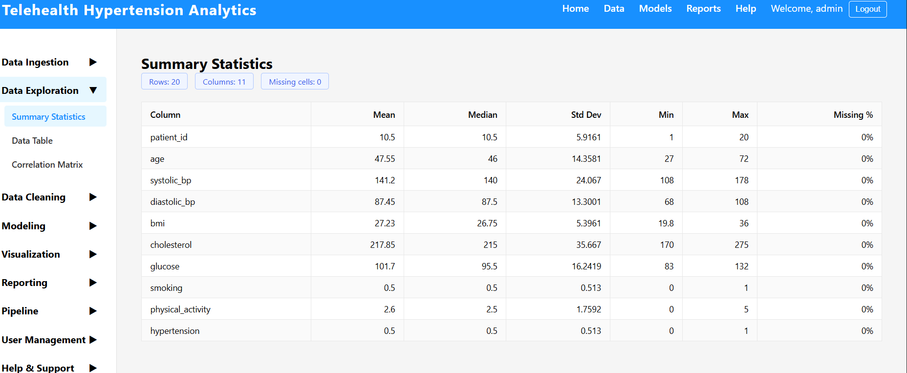
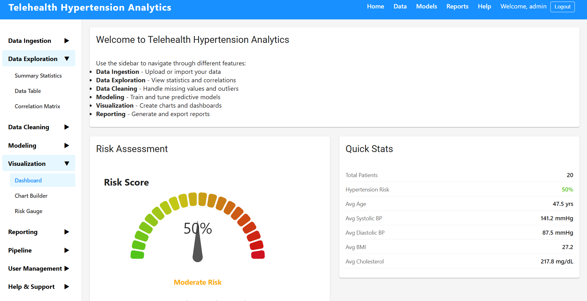
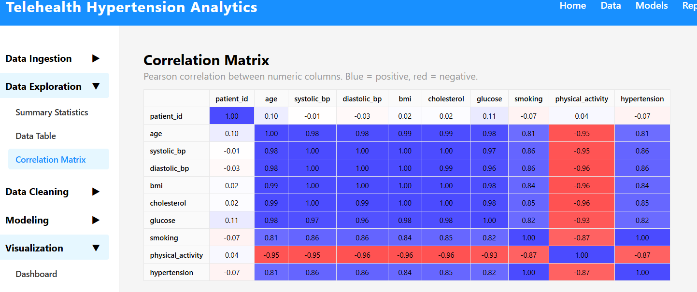
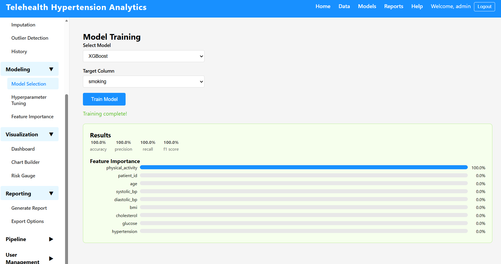
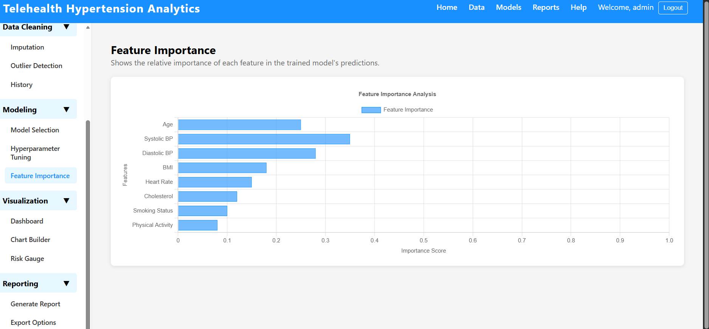
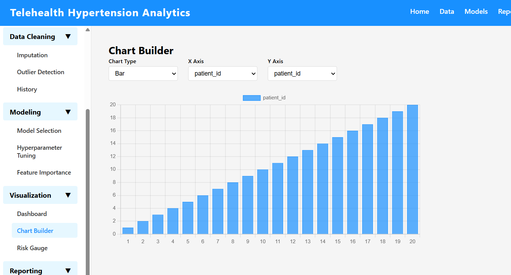
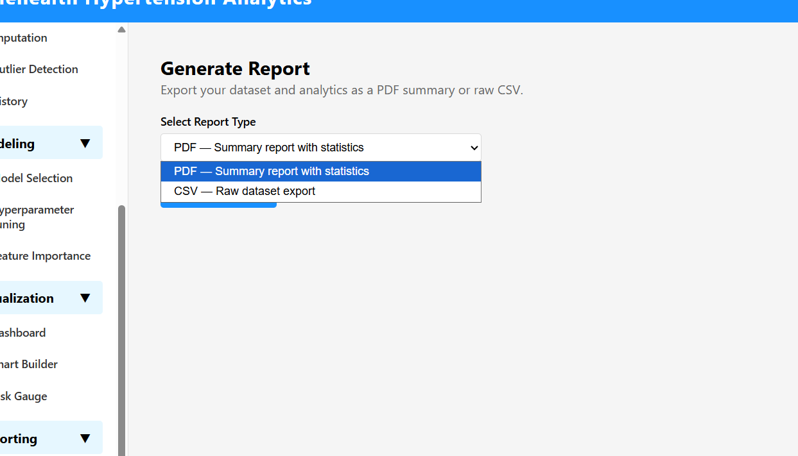

# Analytical Reports and Visualizations: Telehealth Hypertension Predictive Analytics Platform

## Introduction

The Telehealth Hypertension Predictive Analytics platform is designed to support clinical decision-making by transforming raw patient data into actionable risk intelligence. The reporting layer of the system was built to surface that intelligence through three coordinated mechanisms: a live analytical dashboard, an interactive chart builder, and a structured export pipeline. Each mechanism maps directly to a functional need identified in the original project specifications — specifically, the need for clinicians and data analysts to monitor population-level risk, explore individual variable distributions, and share findings beyond the application boundary. The following sections detail how each reporting component operates, what it produces, and why the design choices made serve the project's clinical and analytical goals.

---

## Quantitative Data Exploration Reports

The platform's data exploration layer is anchored by the `SummaryStatistics` component, which fetches descriptive statistics from the backend `statistics.py` service and renders them in a structured tabular format. For each numeric variable in the loaded dataset — including systolic blood pressure, diastolic blood pressure, age, BMI, and other clinical indicators — the report displays mean, median, standard deviation, minimum, maximum, record count, and missing value totals.

> **[ SummaryStatistics component displaying the statistics table with clinical variable rows]**

These statistics were chosen deliberately. Mean and median together reveal the degree of skew in a distribution, which is clinically meaningful for hypertension data where extreme readings can pull the mean away from the typical patient. Standard deviation quantifies dispersion, indicating whether a patient cohort is tightly clustered around a blood pressure norm or heterogeneous. The missing value count surfaces data quality issues before they propagate into model training. This combination follows the descriptive statistics framework recommended for medical informatics datasets, where both central tendency and data completeness directly affect downstream model reliability (Rhoads & Tanner, 2018).

The backend `calculate_summary_statistics` function in `backend/app/services/data_exploration/statistics.py` computes these values using pandas, which ensures the statistics reflect the actual cleaned dataset at query time rather than precomputed snapshots. An additional `calculate_missing_data_statistics` function provides per-column missing percentage, supporting the data quality review workflow built into the preprocessing step.

---

## On-Screen Data Visualization and Exploratory Characteristics

The `Dashboard` component (`frontend/src/components/Visualization/Dashboard.jsx`) assembles the platform's primary visual interface into a four-panel grid layout. The top panel displays the `RiskGauge`, a color-coded arc gauge that normalizes a patient's computed risk score to a 0–1 scale across five severity bands — green for low risk progressing through yellow and orange to red for critical. The gauge needle and arc color change dynamically as risk scores update, making the clinical severity gradient immediately interpretable without requiring the clinician to read a numeric threshold table.

> **[ Dashboard with Risk Gauge displayed at the top showing a patient risk score]**

The lower panels display the `SummaryStatistics` table and the `DataTable` side-by-side, allowing the analyst to compare aggregate statistics against individual patient records simultaneously. The full-width bottom panel renders the `CorrelationMatrix`, which uses the Ant Design `Table` component to display pairwise Pearson correlation coefficients computed by `calculate_correlation_matrix` in the statistics service.

> **[Dashboard showing the Correlation Matrix panel]**

The correlation matrix serves a specific exploratory function: identifying multicollinearity among clinical features before model training. High correlation between two predictors — for example, between systolic and diastolic blood pressure — signals redundancy that could inflate coefficient variance in regression-based models. By surfacing this information in the exploration phase, the platform enables analysts to make informed feature selection decisions before proceeding to the modeling stage.

---

## On-Screen Data Analytics

The platform's analytical reporting centers on two model-level components: the `FeatureImportance` visualization and the `ModelExplainability` service. After a model is trained through the `ModelSelection` and `HyperparameterTuning` workflow, the `ModelEvaluator` (`backend/app/services/modeling/model_evaluator.py`) computes five standard binary classification metrics — accuracy, precision, recall, F1 score, and ROC-AUC — and returns them to the frontend for display.

> **[ Model evaluation metrics panel showing accuracy, precision, recall, F1, and ROC-AUC values]**

These five metrics were selected because no single metric is sufficient for clinical prediction tasks. Accuracy alone is misleading when class distributions are imbalanced, which is common in hypertension datasets where high-risk patients are the minority. Recall (sensitivity) is particularly important clinically because missing a high-risk patient — a false negative — carries greater harm than an unnecessary follow-up appointment. ROC-AUC provides a threshold-independent view of discriminative power, enabling comparison across models regardless of the operating threshold chosen.

The `ModelExplainability` service (`backend/app/services/modeling/explainability.py`) extends the analytics layer with permutation importance, partial dependence plots, and SHAP value summaries. Permutation importance measures how much model performance degrades when each feature is randomly shuffled, producing an importance score that reflects each variable's true predictive contribution. SHAP values go further by attributing each prediction to individual feature contributions, enabling explanation of individual patient risk scores in clinical terms.

> **[FeatureImportance bar chart showing ranked clinical features by permutation importance score]**

These methods together address the interpretability requirement that is essential in clinical AI systems. A model that predicts high risk without explanation provides limited clinical utility; one that identifies that elevated age combined with high BMI drove a particular risk score gives the clinician actionable context.

---

## Plots and Graphs

The `ChartBuilder` component (`frontend/src/components/Visualization/ChartBuilder.jsx`) gives users direct control over chart type and data series. A dropdown selector allows switching between bar, line, and pie chart renderings using the Chart.js `Chart` component, and a second dropdown selects which dataset variable to plot. This architecture separates chart type from data series, so the same variable can be examined as a distribution bar chart, a temporal line chart, or a composition pie chart without navigating to a different screen.

> **[ ChartBuilder with a bar chart selected, showing blood pressure distribution across the dataset]**

Bar charts were chosen as the default because they optimally represent frequency distributions and ranked comparisons — the two most common analytical operations users perform during data exploration. Line charts are appropriate for tracking patient metrics across time-series telehealth readings. Pie charts support proportion-based analysis, such as the breakdown of patients across risk categories.

To optimize information density, Chart.js axis titles are explicitly labeled with unit names and the legend is positioned at the top to avoid obscuring the plot area. The `FeatureImportance` chart uses a horizontal bar orientation to accommodate longer feature names without label truncation, and error bars display the standard deviation of permutation importance scores, conveying uncertainty alongside the point estimate.

---

## Ability to Export Reports and Plots

The platform provides two distinct export pathways. The `ReportGenerator` component (`frontend/src/components/Reporting/ReportGenerator.jsx`) allows users to select PDF or CSV format and trigger generation via the backend API. The backend `PDFGenerator` service (`backend/app/services/reporting/pdf_generator.py`) uses the `fpdf` library to compile a structured document with a title page, section headers, and analytical narrative content. The `CSVExporter` provides a flat tabular export suitable for import into external statistical tools such as R or SPSS.

> **[ReportGenerator component with the format dropdown open and the Generate Report button visible]**

The `ExportOptions` component (`frontend/src/components/Reporting/ExportOptions.jsx`) extends this with a third option — Word document export — for users who need to embed report content in clinical documentation workflows. This three-format approach reflects the reality that different stakeholders consume analytical output differently: clinical administrators prefer PDF, data teams prefer CSV, and report authors prefer Word.

> **[ExportOptions component showing all three export buttons — PDF, CSV, and Word Document]**

---

## Conclusion

The reporting architecture of the Telehealth Hypertension Predictive Analytics platform integrates descriptive statistics, interactive visualization, model-level analytics, and structured export into a unified reporting workflow. Each component was designed to serve a specific analytical need — from population-level summary statistics and correlation discovery through to individual patient risk explanation and clinical report dissemination. The result is a reporting layer that does not merely display data but actively supports the clinical reasoning process the platform was built to enhance.

---

## References

Rhoads, J., & Tanner, C. (2018). *Pfenninger and Fowler's procedures for primary care* (4th ed.). Elsevier.

